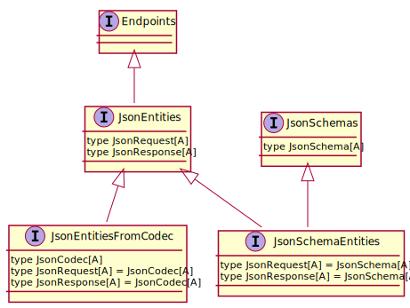

# JSON codecs

The [JSON entities algebras](/algebras/json-entities.md) show that several options
are available to define endpoints having JSON entities. In this guide, we show
which option should be used in which case, and which interpreters are compatible
with which algebras.

The following diagram summarizes which algebra to use in which case:

~~~ mermaid
graph TB
Doc(Do I want to publish documentation?)-->|yes| JsonEntitiesFromSchemas
Doc -->|no| Codec(Do I want to implement both a client and a server?)
Codec -->|yes| JsonEntitiesFromCodecs
Codec -->|no| JsonEntities

style JsonEntitiesFromSchemas fill:#fff
style JsonEntitiesFromCodecs fill:#fff
style JsonEntities fill:#fff
~~~

The first question to ask is “do I want to publish documentation of my
endpoints?”. In order to document the JSON entities of your requests and
responses you need a JSON schema for them, that’s why you have to use the
`JsonEntitiesFromSchemas` algebra. See [below](#jsonentitiesfromschemas) for more details.

In case you don’t need to document the schema of your JSON entities, the
second question to ask is “do I implement both a client and a server?”.
If this is the case, then you need to be able to both encode and decode
each JSON entity (an entity encoded by the server will be decoded by the
client, and _vice versa_). To ensure that encoders and decoders are consistent
together both have to be provided at the definition site of your endpoints, that’s
why you should use the `JsonEntitiesFromCodecs` algebra. See
[below](#jsonentitiesfromcodecs) for more details.

Last, if you answered “no” to both questions, then you don’t need to use an algebra,
you can directly use the `JsonEntities` interpreter for your specific client or server.
With this approach, you will have to provide either an encoder or a decoder for each
JSON entity on case-by-case basis: if you implement a client for an endpoint whose
response contains a JSON entity, you will only need a decoder.

The next section reminds general information about the `JsonEntities` hierarchy,
and the remaining sections provide more details on how to use `JsonEntitiesFromSchemas`
and `JsonEntitiesFromCodecs`.

## The `JsonEntities` hierarchy

The following diagram shows the relations between the three aforementioned algebras,
`JsonEntities`, `JsonEntitiesFromCodecs`, and `JsonEntitiesFromSchemas`, and their relations
with the other algebras:

The `JsonEntities` algebra adds to the `Endpoints` algebra the capability to describe
JSON entities in requests and responses. The `JsonEntitiesFromCodecs` algebra refines
the `JsonEntities` algebra by aligning the request and response entities to the same
`JsonCodec` type. Finally, the `JsonEntitiesFromSchemas` algebra refines the `JsonEntities`
algebra by aligning the request and response entities to the same `JsonSchema` type.

## `JsonEntitiesFromSchemas`

### Algebra

The `JsonEntitiesFromSchemas` algebra allows you to define a schema for your JSON entities.
This schema can then be used to derive a documentation (by applying the `endpoints.openapi.JsonEntitiesFromSchemas`
interpreter), or codecs (by applying a corresponding interpreter for your client or server, e.g.
`endpoints.akkahttp.server.JsonEntitiesFromSchemas` to use an Akka HTTP server).

Both the `JsonRequest` and `JsonResponse` types are fixed to the same
`JsonCodec` type, which is itself fixed to the `JsonSchema` type provided
by the [JsonSchemas](/algebras/json-schemas.md) algebra:

~~~ scala src=../../../../../algebras/algebra/src/main/scala/endpoints/algebra/JsonEntities.scala#type-carrier
~~~

This means that you have to define such a `JsonSchema[A]` implicit value (as explained in
the `JsonSchemas` documentation) for each type `A` that you want to carry as a JSON entity.

### Interpreters

To interpret endpoints defined with this algebra, pick an interpreter that matches your
[family](/algebras-and-interpreters.md#interpreters) of interpreters. For instance, the
`endpoints.play.server.JsonEntitiesFromSchemas` trait is a server interpreter based
on Play framework.

## `JsonEntitiesFromCodecs`

### Algebra

In case you don’t need to document the JSON schemas of your request and response entities, the
`JsonEntitiesFromCodecs` family of algebras is the preferred approach. These algebras fix both
the `JsonRequest` and `JsonResponse` types to a same (abstract) `JsonCodec` type:

~~~ scala src=../../../../../algebras/algebra/src/main/scala/endpoints/algebra/JsonEntities.scala#json-codec-type
~~~

Generally, you want to use a `JsonEntitiesFromCodecs` algebra that fixes this `JsonCodec` type to
a concrete type. An example is `endpoints.algebra.playjson.JsonEntitiesFromCodecs`, which
aligns the `JsonCodec` type with Play’s `Format` type:

~~~ scala src=../../../../../algebras/algebra-playjson/src/main/scala/endpoints/algebra/playjson/JsonEntitiesFromCodecs.scala#type-carrier
~~~

The [JSON entities algebra](/algebras/json-entities.md#jsonentitiesfromcodecs) documentation page
shows the list of `JsonEntitiesFromCodecs` algebras that fixes the `JsonCodec` type to a concrete type.

### Interpreters

To interpret endpoints defined with such algebras, apply any interpreter named `JsonEntitiesFromCodecs`
that matches your [family](/algebras-and-interpreters.md#interpreters) of interpreters. For instance,
if you use interpreters from the `endpoints.xhr` package (ie. the Scala.js web interpreters), you
should use the `endpoints.xhr.JsonEntitiesFromCodecs` interpreter.
